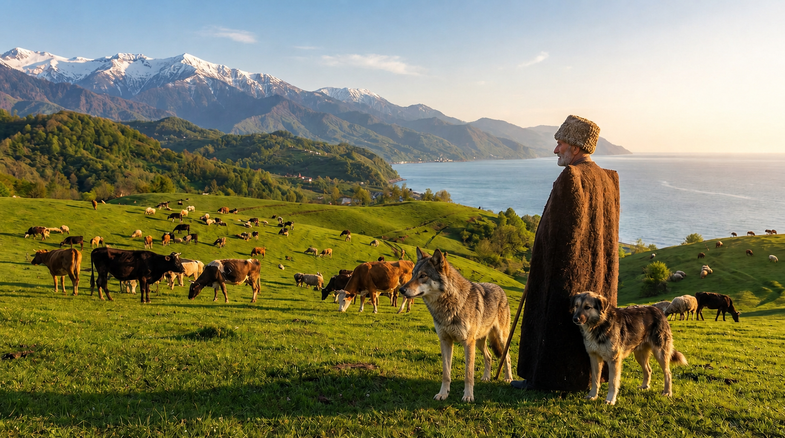

# Final Exam - Introduction to AI
**Student:** Ahmed Abdalla  
**Date:** July 7, 2026

---

## Task 1: Using Generative AI

**Objective:** Add a wolf to the provided template image.

**Result:**

---

## Task 2: User Manual for Task 1

### Step-by-Step Guide to Adding an Object to an Image using AI

This manual describes the process of using a state-of-the-art Generative AI tool (e.g., Leonardo.ai or Adobe Firefly) to perform an "Inpainting" or "Image-to-Image" task.

#### 1. Account Setup and Sign-up
1. **Visit the Platform:** Go to [Leonardo.ai](https://leonardo.ai/) or your chosen AI image generator.
2. **Create an Account:**
   - Click on the **"Create an Account"** button.
   - You can sign up using a Google account, Apple ID, or a professional email address.
   - Follow the on-screen prompts to verify your email and set up your profile.
3. **Access the Dashboard:** Once logged in, navigate to the **"AI Canvas"** or **"Image Generation"** tool.

#### 2. Implementing the Modification
1. **Upload the Base Image:**
   - Select the **"Upload Image"** option.
   - Choose the `picture-template.jpeg` file from your local storage.
2. **Define the Edit Area (Masking):**
   - Use the **Mask Tool** (brush) to highlight the area where the wolf should be placed. 
   - *Tip:* Ensure the mask covers a natural spot in the landscape to allow the AI to blend the edges.
3. **Construct the Prompt:**
   - In the prompt box, enter a descriptive command:  
     `"A realistic, majestic grey wolf standing naturally in the landscape, cinematic lighting, highly detailed fur, 8k resolution, seamlessly integrated with the background."`
4. **Adjust Settings:**
   - Set the **Inpainting Strength** (or Creativity Strength) to a medium level (around 0.5 - 0.7) to ensure the AI respects the original background while generating a high-quality wolf.
5. **Generate and Refine:**
   - Click **"Generate"**.
   - Review the results. If the wolf's placement or lighting looks off, adjust the mask or refine the prompt and generate again.
6. **Save the Result:**
   - Once satisfied, click **"Download"** to save the final image as `wolf_result.png`.

#### Visual Process
**Initial Image:**

**Final Result:**

---

## Task 3: Finding the Graph

**Objective:** Map all reachable nodes and transitions from the Graph Navigator Bot.

**Graph Map:**

---

## Task 4: GPA Calculator Web Application

The GPA calculator has been implemented as a single-file web application located in the `/gpa` directory. 

**Key Features:**
- **Dynamic Course Table:** Displays all transcript courses and 5 additional program courses.
- **GPA Formula Implementation:** Strictly follows the Ilia State University official GP conversion logic.
- **Interactive Tooltip:** Provides a full English translation of the GPA regulation document.
- **Scenario Calculation:** Includes a specialized button to simulate the impact of the "Introduction to AI" final exam.

**Application File:** `gpa/index.html`
